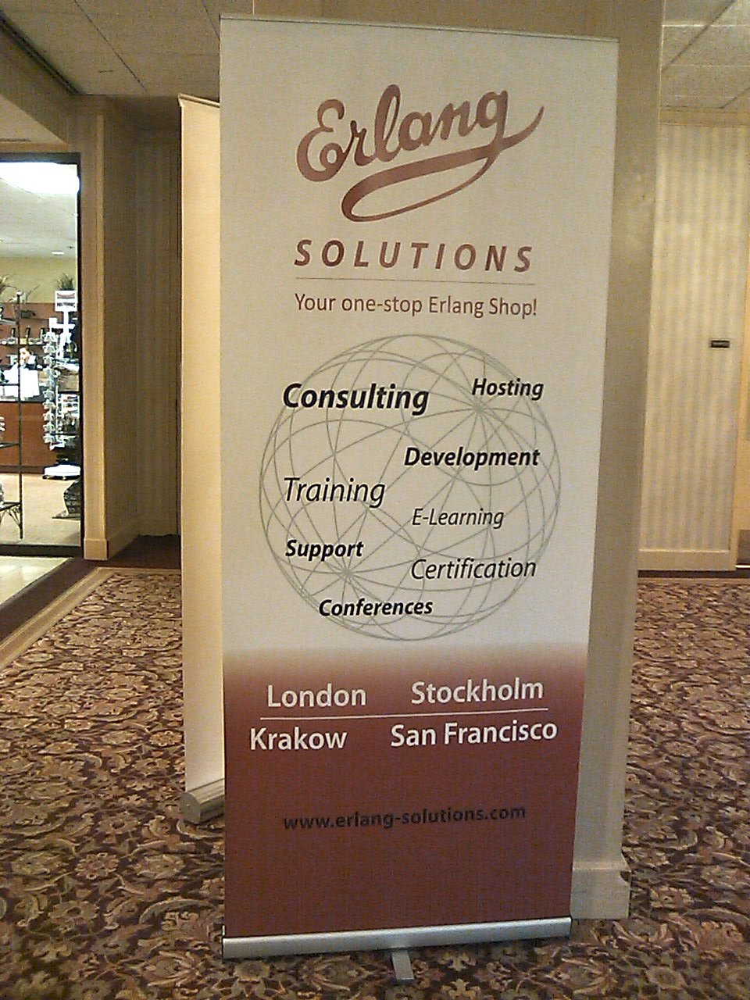

theme: Simple, 2
footer: Kenji Rikitake / Erlang and Elixir Fest 2018 16-JUN-2017
slidenumbers: true

<!-- Use Deckset 2.0, 4:3 aspect ratio -->

# [fit] ErlangとElixirが突き付けるもの
## [fit] あるいは性能と安全の終わりなき戦いについて

---

# [fit] 力武 健次
# [fit] りきたけ けんじ

2018年6月16日
Erlang and Elixir Fest 2018
秋葉原コンベンションホール
@jj1bdx

---

# [fit] お仕事募集中です
## 53歳 / プログラミング歴44年
## ソフトウェアエンジニア歴28年目
## Erlang/OTP歴11年目
## 力武健次技術士事務所 所長
## ペパボ研究所 客員研究員
### [fit]先月まで7ヶ月C++とC#とsvnとVisual Studioの仕事してました

---

# [fit] Erlang/OTPとの出会い

---

# 2008年2月

## [fit] C言語に絶望していた
## [fit] 東京 日本橋 丸善
## [fit] 手にとってみた
## [fit] 面白い
## [fit] すぐに通販で買って読んだ

---

# [fit] Erlang/OTPコミュニティへ

## [fit] 最初はFreeBSDでのうるう秒パッチから
## [fit] そのうちWindowsと混ぜたりいろいろ実験
## [fit] 当時はセキュリティ関連の研究をしていた
## [fit] SSHのRPCとか思いつく
## [fit] …発表できそう

---

# 2010年3月

## [fit] サンフランシスコへ
## [fit] 実際はBurlingameで
## Erlang Factory SF Bay 2010

---

# [fit] そして長い付き合いが始まる

---

# 2011年9月

## 東京でICFP
## Erlang Workshop
## [fit] 実行委員長を頼まれる
## [fit] なんとかやり切る

---

# [fit]実は2011年に

## [fit]すごいE本
## [fit]…の原典となるプレゼンが
## [fit]サンフランシスコで行われた

---

# [fit] いろいろと面白くなってくる

---

# [fit] Elixirとの出会い

---

# 2014年3月
# [fit] Erlang Factory SF Bay 2014

---

# José Valim

---

# Dave Thomas

---

## この講演は
## [fit] GMOペパボ株式会社
## [fit] ペパボ研究所の
## [fit] ご協力で実現しました

---

[.autoscale: true]

# Photo credits

* Title: [Samuel Wong](https://unsplash.com/photos/rznBKkZiIEk) on Unsplash.com
* José Valim: By Augie De Blieck from USA (elixirconf-47), [CC BY 2.0](https://creativecommons.org/licenses/by/2.0), [via Wikimedia Commons](https://upload.wikimedia.org/wikipedia/commons/e/ed/Jos%C3%A9_Valim_-_elixirconf-47_%2814795675281%29.jpg)
* Dave Thomas: By James Davidson (Flickr: Dave Thomas) [CC BY 2.0](https://creativecommons.org/licenses/by/2.0)], [via Wikimedia Commons](https://upload.wikimedia.org/wikipedia/commons/f/fe/Dave_Thomas_speaking_at_the_Pasadena_Rails_Studio.jpg)

<!--
Local Variables:
mode: markdown
coding: utf-8
End:
-->
