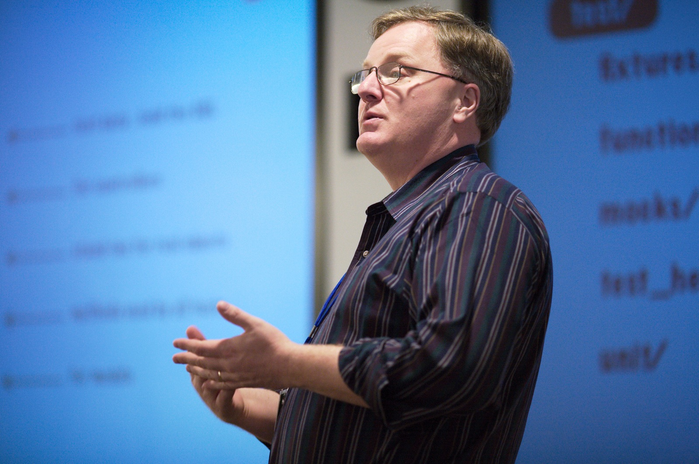

theme: Simple, 2
footer: Kenji Rikitake / Erlang and Elixir Fest 2018 16-JUN-2017
slidenumbers: true

<!-- Use Deckset 2.0, 4:3 aspect ratio -->


# [fit] ErlangとElixirが突き付けるもの
## [fit] あるいは性能と安全の終わりなき戦いについて

---


# [fit] 力武 健次
# [fit] りきたけ けんじ

2018年6月16日
Erlang and Elixir Fest 2018
秋葉原コンベンションホール
@jj1bdx

---

# [fit] お仕事募集中です
## 53歳 / プログラミング歴44年
## ソフトウェアエンジニア歴28年目
## Erlang/OTP歴11年目
## 力武健次技術士事務所 所長
## ペパボ研究所 客員研究員
### [fit]先月まで7ヶ月C++とC#とsvnとVisual Studioの仕事してました

---

# [fit] この10年を振り返る

---

# [fit] Erlang/OTPとの出会い

---


# 2008年2月

## [fit] C言語に絶望していた
## [fit] 東京 日本橋 丸善
## [fit] 手にとってみた
## [fit] 面白い
## [fit] すぐに通販で買って読んだ

---

# [fit] Erlang/OTPコミュニティへ

## [fit] 最初はFreeBSDでのうるう秒パッチから
## [fit] そのうちWindowsと混ぜたりいろいろ実験
## [fit] 当時はセキュリティ関連の研究をしていた
## [fit] SSHのRPCとか思いつく
## [fit] …発表できそう

---


# 2010年3月

## Erlang Factory SF Bay 2010

---

# [fit] 長い付き合いが始まる

---


# 2011年9月

## 東京で
## Erlang Workshop
## [fit] 実行委員長をやり切る

---


# [fit]実は2011年に

## [fit]すごいE本
## [fit]…の原典となるプレゼンが
## [fit]サンフランシスコで行われた

---

# [fit] 面白くなってくる

---

# [fit] Elixirとの出会い

---

# 2014年3月
# [fit] Erlang Factory SF Bay 2014

---


# José Valim

---



# Dave Thomas

---

# [fit] 衝撃的な講演
## [fit] 結構な物議を醸して大変だったみたいですが 

---

# [fit] Catalyze changes
# [fit] 変化の触媒となれ

---

# 講演内容（の要旨）
# [fit] Erlangは読みにくい!
# [fit] レコードが難しい!
# [fit] ドキュメントがない!
# [fit] なんとかしようぜ!

---


# [fit] 有言実行

## Dave ThomasはElixirと関連技術のプロモーションに尽力
## 自分で1冊
## PragProgで7冊

---


# 2016年

## プログラミングElixir日本語版登場
## Rubyコミュニティの人達をちらほらと見かけるようになった

---

# [fit]2018年
# [fit]2月に大事件

---

# [fit] erlang-questions メーリングリストにて
# こともあろうに差別用語を自分のレポジトリに付けてしまった人がいた
# **すごいE本の著者が抗議**

---

# [fit]大論争
# [fit]収拾するのが大変だったらしいです

---


# 2018年5月31日〜6月1日
# [fit] スウェーデンのストックホルムにて
# Code BEAM STO 2018

---


# 会議のテーマ

## [fit] Open Erlang 20周年
## [fit] BEAMコミュニティの融合
## [fit] 日常としてのダイバーシティ

---

# [fit] コミュニティの成熟と成長
# [fit] 技術の先に何を目指すか

---

# [fit] 長い前振りを終わります

---

# [fit] 本題

---

# [fit] ErlangとElixir
# [fit] そしてその他のLFE, efene, Alpaca, clojerl, luerl, etc. 
# [fit] どこがおいしいの?

---

# 力武にとっての衝撃
# [fit] Immutability
# [fit] ディープコピー
# [fit] 参照を使わない

---

# 従来の言語

# [fit] 変数は再利用
# [fit] 参照しかコピーしない
# [fit] できる限り実体を共有
# [fit] ↑すべてバグの元

---

# 従来の言語の原則

# [fit] 極力コピーしたくない
# [fit] 極力メモリを節約したい
# [fit] **安全よりも効率**
# [fit] 代入の履歴を取れない

---

# C++で困ったこと

# [fit] 変数は値? 参照?
# [fit] const付き? なし?
# [fit] コンストラクタはいつ動く?
# [fit] `std::unique_ptr<> あるいは shared_ptr<>`
# [fit] →複数の矛盾するセマンティクスが同時に存在

---

# [fit] ErlangやElixirでは困りません

# [fit] 変数はすべて実体
# [fit] 一度確定した実体は不変
# [fit] 代入は必ず新しい実体を作る
# [fit] 参照を考えなくていいから楽
# [fit] （ETSとかプロセス辞書とか使うと大変ですが）

---

# ErlangやElixirの原則

# [fit] 必要ならどんどんコピー
# [fit] メモリ節約はGCで
# [fit] **効率よりも安全**
# [fit] 代入の履歴を取れる

---

# JavaScriptの例

```javascript
// var a = {first: 1, second: 2}
// b = a // 参照のみの共有
{ first: 1, second: 2 }
// a.second = 3 
3
// b // 要素の実体は共有
{ first: 1, second: 3 }
// b == { first: 1, second: 3 }
false // なぜ?
// 右側はコンストラクタなので一致しない
```

---

# Erlang/OTPの例

```erlang
%%% 代入する実体は常に新しくつくられる
%%% 再代入はそもそもできない
% A1 = {1,2,3}.
{1,2,3}
% B1 = A1.
{1,2,3} % コピーができる
% A2 = setelement(3,A1,4).
{1,2,4}
% B1 =:= {1,2,3}.
true
```

---

# ErlangやElixirのデメリット

# [fit] とても遅い
# [fit] 発想の転換が必要
# [fit] RubyやPHPのようには書けません

---

# [fit] Erlangの開発者の一人 
# [fit] Joe Armstrongは
# [fit] どう考えているのか

---


---

# Erlang/Elixirで大事なこと

# [fit] 軽量並行プロセス
# [fit] エラーハンドリング
# [fit]（と、Immutabilityだと、力武は思っています）

---

# 軽量並行プロセス

<!-- TBD -->

---

# Erlangのエラーハンドリング
# リンク (link)
# モニター (monitor)

---

# リンクによる例外シグナル [^1]


[^1]: https://github.com/jj1bdx/ipsj-tokai-20121029-public/blob/master/boogieboard/trapexit.jpg

---

# モニターによる例外メッセージ[^2]


[^2]: 力武健次、「Erlangで学ぶ並行プログラミング第8回」、Software Design 2015年11月号、技術評論社、p. 124の図を再構成。

---

# [fit] 最後に昨年に引き続き
# [fit] お願い

---

# [fit] コミュニティに
# [fit] 日本の人が
# [fit] いません

---

# [fit] 日本国外で
# [fit] 英語の
# [fit] 成果発表を!

---


## [fit] 謝辞
## この講演は
## [fit] GMOペパボ株式会社
## [fit] ペパボ研究所の
## [fit] ご支援で実現しました
## [fit] ありがとうございます

---

# [PR]
# [fit] 力武健次技術士事務所では
# [fit] お仕事募集中です
# [fit] ご相談歓迎致します
# [fit] ぜひ懇親会でお声がけください

---

# [fit] おしまい
# [fit] ありがとうございました
# [fit] ご質問をどうぞ

---

[.autoscale: true]

# 写真等クレジット

* Title: [Samuel Wong](https://unsplash.com/photos/rznBKkZiIEk) on Unsplash.com
* José Valim: By Augie De Blieck from USA (elixirconf-47), [CC BY 2.0](https://creativecommons.org/licenses/by/2.0), [via Wikimedia Commons](https://upload.wikimedia.org/wikipedia/commons/e/ed/Jos%C3%A9_Valim_-_elixirconf-47_%2814795675281%29.jpg)
* Dave Thomas: By James Davidson (Flickr: Dave Thomas) [CC BY 2.0](https://creativecommons.org/licenses/by/2.0)], [via Wikimedia Commons](https://upload.wikimedia.org/wikipedia/commons/f/fe/Dave_Thomas_speaking_at_the_Pasadena_Rails_Studio.jpg)
* [Pragmatic Bookshelf Elixir/OTP/Phoenix books page](https://pragprog.com/titles/category/elixir)
* [リンクによる例外シグナル送信例](https://github.com/jj1bdx/ipsj-tokai-20121029-public/blob/master/boogieboard/trapexit.jpg)

* スライド中の書籍の表紙と中表紙についてはオーム社、No Starch Press, Pragmatic Bookshelfの書籍情報を専ら書籍紹介の目的で使用しています。
* 上記に注釈のない写真、図、絵については力武健次が撮影、編集、制作しています。

<!--
Local Variables:
mode: markdown
coding: utf-8
End:
-->
